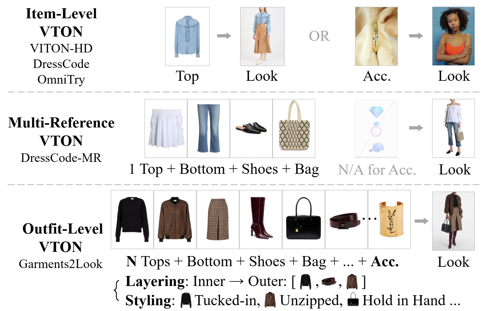
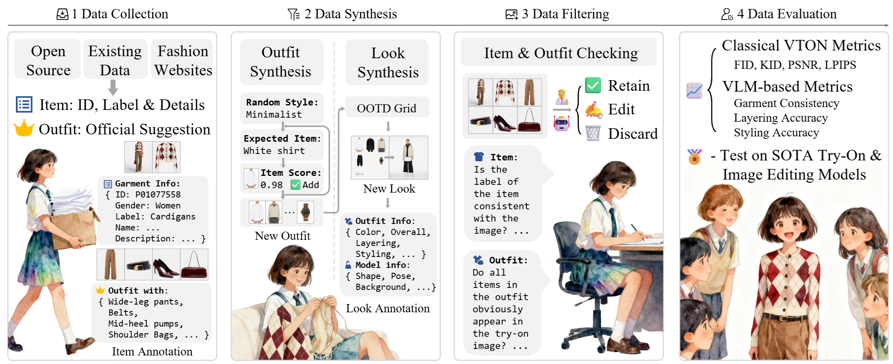
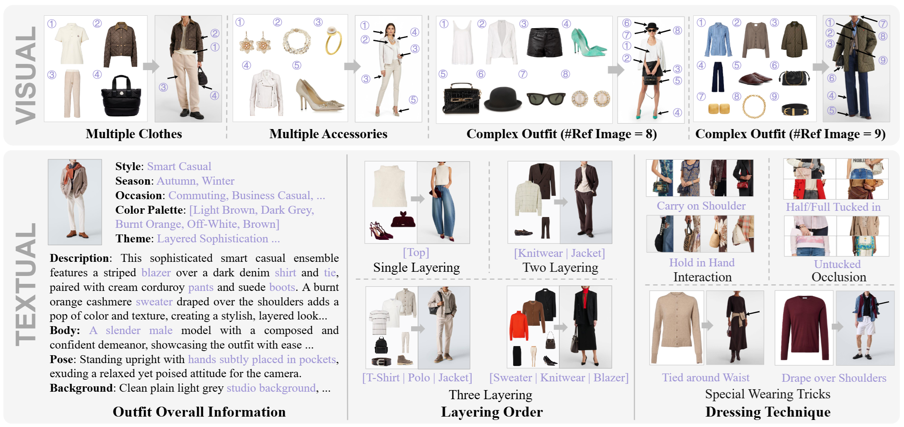

# Garments2Look

> **Paper**: Garments2Look: A Multi-Reference Dataset for High-Fidelity Outfit-Level Virtual Try-On with Clothing and Accessories
>
> **Authors**: [Junyao Hu](https://junyaohu.github.io/), [Zhongwei Cheng](https://scholar.google.com/citations?user=ayN-dVwAAAAJ), [Waikeung Wong](https://research.polyu.edu.hk/en/persons/wai-keung-wong-2/), [Xingxing Zou](https://scholar.google.com/citations?user=UhnQA3UAAAAJ)

- Paper: arXiv (TBD), CVPR (TBD)
- [Project Page](https://artmesciencelab.github.io/Garments2Look/)
- [Dataset](https://huggingface.co/datasets/ArtmeScienceLab/Garments2Look)
- [Comparison Results on Test Set](https://huggingface.co/datasets/ArtmeScienceLab/Garments2Look-Test-Set-Results)

# Abstract

Virtual try-on (VTON) has advanced single-garment visualization, yet real-world fashion centers on full outfits with multiple garments, accessories, fine-grained categories, layering, and diverse styling, remaining beyond current VTON systems. Existing datasets are category-limited and lack outfit diversity. We introduce Garments2Look, the first large-scale multimodal dataset for outfit-level VTON, comprising 80K many-garments-to-one-look pairs across 40 major categories and 300+ fine-grained subcategories. Each pair includes an outfit with 3-12 reference garment images (Average 4.48), a model image wearing the outfit, and detailed item and try-on textual annotations. To balance authenticity and diversity, we propose a synthesis pipeline. It involves heuristically constructing outfit lists before generating try-on results, with the entire process subjected to strict automated filtering and human validation to ensure data quality. To probe task difficulty, we adapt SOTA VTON methods and general-purpose image editing models to establish baselines. Results show current methods struggle to try on complete outfits seamlessly and to infer correct layering and styling, leading to misalignment and artifacts.



**Input and output.** Outfit-level dataset is collected and generated from a large-scale set of real images, each paired with diverse clothing and accessories, and including the information of outfit layering and styling.



**Overview of Garments2Look construction process.** Our dataset follows four steps: (1) Data Collection: obtaining realworld clothing items and their outfit suggestions from different sources; (2) Data Synthesis: enriching the dataset content and diversity by generating new outfit lists and look images; (3) Data Filtering: ensuring visual consistency and data quality, including annotations of garment images, outfit lists and look images; and (4) Data Evaluation: verifying the data quality, designing new metrics for outfit-level VTON task, and testing SOTA models.



**Data structure.** This dataset provides high-quality, high-precision, and highly diverse samples of complex and complete clothing combinations.

# Citation
```bibtex
@inproceedings{cvpr2026garments2look,
    title={Garments2Look: A Multi-Reference Dataset for High-Fidelity Outfit-Level Virtual Try-On with Clothing and Accessories},
    author={Hu, Junyao and Cheng, Zhongwei and Wong, Waikeung and Zou, Xingxing},
    booktitle={Proceedings of the IEEE/CVF Conference on Computer Vision and Pattern Recognition (CVPR)},
    year={2026}
}
```