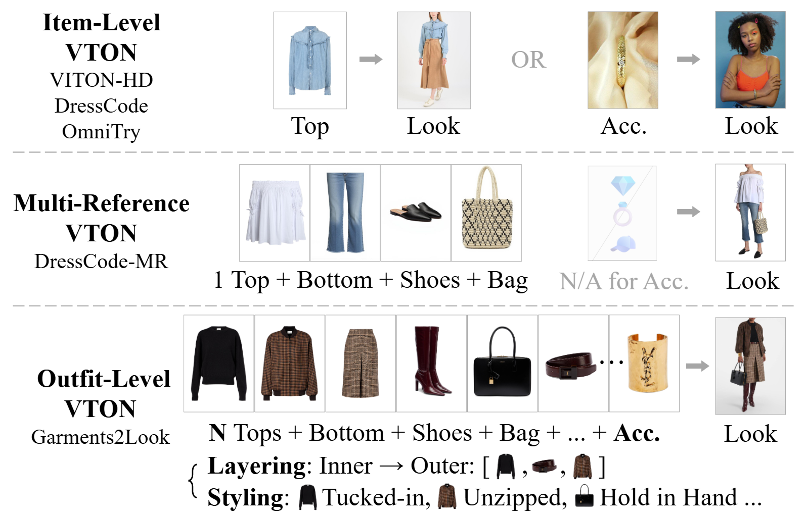
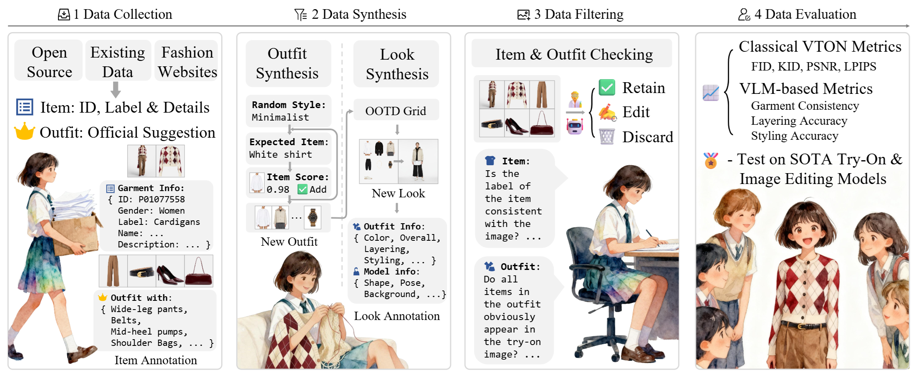
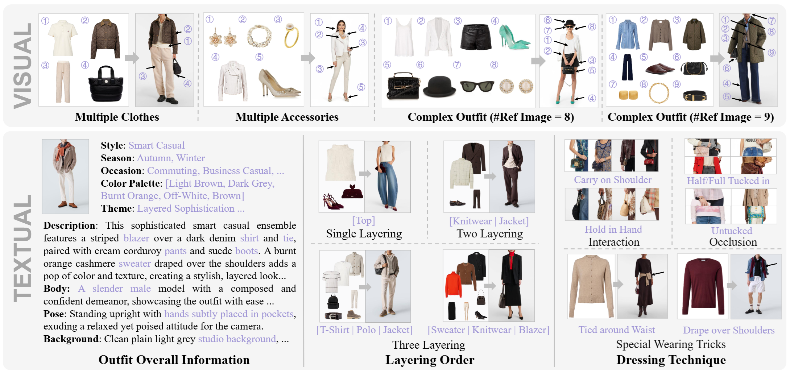

# Garments2Look [CVPR 2026]

> **Paper**: Garments2Look: A Multi-Reference Dataset for High-Fidelity Outfit-Level Virtual Try-On with Clothing and Accessories
>
> **Authors**: [Junyao Hu](https://junyaohu.github.io/), [Zhongwei Cheng](https://scholar.google.com/citations?user=ayN-dVwAAAAJ), [Waikeung Wong](https://research.polyu.edu.hk/en/persons/wai-keung-wong-2/), [Xingxing Zou](https://scholar.google.com/citations?user=UhnQA3UAAAAJ)

- Paper: [arXiv](https://arxiv.org/abs/2603.14153), [CVPR](https://openaccess.thecvf.com/content/CVPR2026/html/Hu_Garments2Look_A_Multi-Reference_Dataset_for_High-Fidelity_Outfit-Level_Virtual_Try-On_with_CVPR_2026_paper.html), [中译版](./docs/Garments2Look-Chinese.pdf)
- [Project Page](https://artmesciencelab.github.io/Garments2Look/)
- [Poster](./docs/poster.pdf)
- [Dataset](https://huggingface.co/datasets/ArtmeScienceLab/Garments2Look)
- [Comparison Results on Test Set](https://huggingface.co/datasets/ArtmeScienceLab/Garments2Look-Test-Set-Results)

https://github.com/user-attachments/assets/a2926af9-8ab2-435b-9afc-5b2587458efa


## News and updates

- **[2026-04-09]** Garments2Look was accepted to **CVPR 2026**.
- **[2026-03-17]** Released the [Garments2Look dataset](https://huggingface.co/datasets/ArtmeScienceLab/Garments2Look), including all image data and inputs for the inpainting task setting.
- **[2026-03-14]** Submitted the first version of our paper to [arXiv](https://arxiv.org/abs/2603.14153).

## TODO

- [ ] Release evaluation scripts.
- [ ] Release editing-task inputs.
- [ ] Release Qwen 2509 LoRAs for inpainting and editing.
- [ ] Train and open-source Qwen Image 2.1 LoRAs.
- [ ] Update the dataset loader and examples.

## Overview

Virtual try-on (VTON) has advanced single-garment visualization, yet real-world fashion centers on full outfits with multiple garments, accessories, fine-grained categories, layering, and diverse styling, remaining beyond current VTON systems. Existing datasets are category-limited and lack outfit diversity. We introduce Garments2Look, the first large-scale multimodal dataset for outfit-level VTON, comprising 80K many-garments-to-one-look pairs across 40 major categories and 300+ fine-grained subcategories. Each pair includes an outfit with 3-12 reference garment images (4.48 items per outfit on average), a model image wearing the outfit, and detailed item and try-on textual annotations. To balance authenticity and diversity, we propose a synthesis pipeline. It involves heuristically constructing outfit lists before generating try-on results, with the entire process subjected to strict automated filtering and human validation to ensure data quality. To probe task difficulty, we adapt SOTA VTON methods and general-purpose image editing models to establish baselines. Results show current methods struggle to try on complete outfits seamlessly and to infer correct layering and styling, leading to misalignment and artifacts.



**Dataset comparison.** Garments2Look targets complete outfits with multiple clothing items and accessories, including annotations of layering and styling.

## Dataset construction



**Overview of Garments2Look construction process.** Our dataset follows four steps: (1) Data Collection: obtaining real-world clothing items and their outfit suggestions from different sources; (2) Data Synthesis: enriching the dataset content and diversity by generating new outfit lists and look images; (3) Data Filtering: ensuring visual consistency and data quality, including annotations of garment images, outfit lists and look images; and (4) Data Evaluation: verifying the data quality, designing new metrics for outfit-level VTON task, and testing SOTA models.



**Sample outfits and annotations.** Each sample pairs multiple reference items with a look image and annotations describing the outfit, layering, and styling.

## Download and preparation

Download the annotations and image archives from [Hugging Face](https://huggingface.co/datasets/ArtmeScienceLab/Garments2Look/tree/main):

```bash
python -m pip install -U huggingface_hub
hf download ArtmeScienceLab/Garments2Look --repo-type dataset \
  --local-dir /path/to/Garments2Look-data
```

The image archives and JSON annotations total approximately **284 GB (264 GiB) compressed**; the full download also includes supplementary files. Allow additional space for extracted files. Mytheresa images and looks use numbered archive parts; download all parts of each archive before extracting.

On Linux, inspect archive member paths first (repeat for other archives):

```bash
cd /path/to/Garments2Look-data
tar -tzf polyvore/images.tar.gz | head
```

If archive members start with `images/`, `looks-resized/`, or `annotations/`, extract into the corresponding subset directory:

```bash
cat mytheresa/images.tar.gz.part-* | tar -xzf - -C mytheresa
cat mytheresa/looks-resized.tar.gz.part-* | tar -xzf - -C mytheresa
tar -xzf mytheresa/annotations.tar.gz -C mytheresa

tar -xzf polyvore/images.tar.gz -C polyvore
tar -xzf polyvore/looks-resized.tar.gz -C polyvore
tar -xzf polyvore/annotations.tar.gz -C polyvore
```

If members already begin with `mytheresa/` or `polyvore/`, extract into the dataset root instead. Streaming the split archives avoids storing an extra combined archive. Keep the released filenames and organize the extracted data as follows:

```text
Garments2Look-data/
├── mytheresa_image_v1.0_2512.json
├── mytheresa_outfit_v1.0_2512.json
├── polyvore_image_v1.0_2512.json
├── polyvore_outfit_v1.0_2512.json
├── mytheresa/
│   ├── images/
│   ├── looks-resized/
│   └── annotations/mask-sam3-resized/
└── polyvore/
    ├── images/
    ├── looks-resized/
    └── annotations/mask-sam3-resized/
```

## Benchmark and release contents

See the paper for baseline comparisons, evaluation protocols, and metric definitions. Released model outputs are available in the [test-set comparison results](https://huggingface.co/datasets/ArtmeScienceLab/Garments2Look-Test-Set-Results).

| Resource | Location |
| --- | --- |
| Dataset annotations and image archives | [Hugging Face dataset](https://huggingface.co/datasets/ArtmeScienceLab/Garments2Look) |
| Test-set comparison outputs | [Results dataset](https://huggingface.co/datasets/ArtmeScienceLab/Garments2Look-Test-Set-Results) |
| Paper, poster, and figures | Links above and [`docs/`](./docs/) |

This repository currently provides dataset documentation and paper materials. A replacement dataset loader will be added in a future update. Complete baseline training, inference, and metric implementations are not included here.

## License

The Garments2Look dataset is released under the [Apache License 2.0](https://www.apache.org/licenses/LICENSE-2.0), permitting commercial use, modification, and redistribution under its terms. Retain applicable copyright, attribution, and license notices, including those accompanying third-party materials.

Licenses for code and LoRA weights will be specified upon release.

## Citation

If you use our dataset or models in your research, please consider citing our paper:

```bibtex
@inproceedings{cvpr2026garments2look,
    title={Garments2Look: A Multi-Reference Dataset for High-Fidelity Outfit-Level Virtual Try-On with Clothing and Accessories},
    author={Hu, Junyao and Cheng, Zhongwei and Wong, Waikeung and Zou, Xingxing},
    booktitle={Proceedings of the IEEE/CVF Conference on Computer Vision and Pattern Recognition (CVPR)},
    year={2026}
}
```
