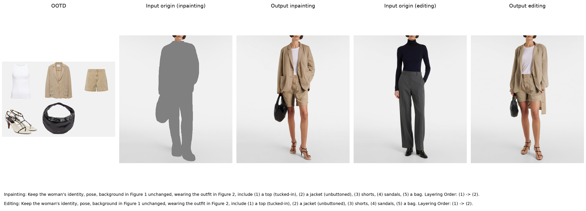
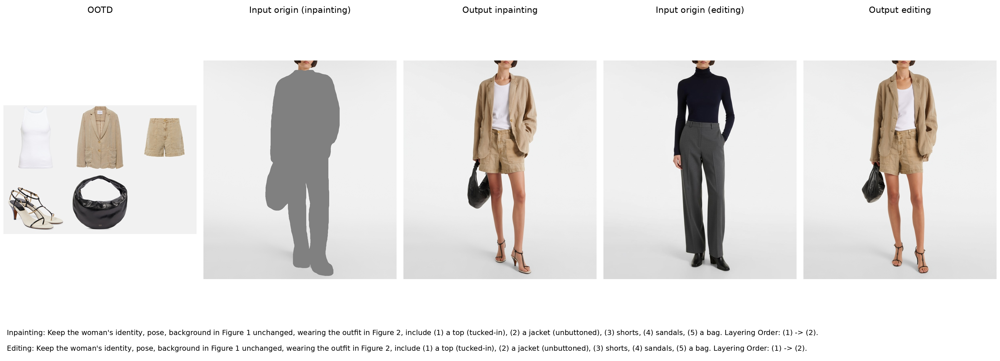

# Paired inference example

Test outfit **P00958796_b1**, selected from six candidates at fixed seed **0**. Styling: top tucked in, jacket unbuttoned. Layering: top → jacket.

- `qwen2509/`: released 20k, second-epoch adapters; CFG 4.
- `qwen21/`: final step-48534 adapters trained on 97,068 samples for one epoch; CFG 1.
- Both tasks use 40 steps. Each directory includes inputs, full prompts, target, outputs, parameter records, and five-column comparisons.
- Legacy flat files mirror `qwen2509/`.

## Qwen-Image-Edit-2509

## Qwen-Image-2.1

This is a selected qualitative example, not aggregate benchmark evidence. See the root README for installation and all four inference commands.
