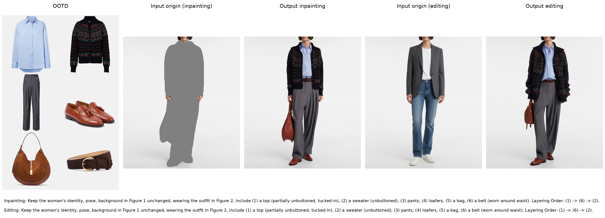

# Garments2Look examples

Inputs, OOTD reference, and full task prompts are stored here. The outputs use seed 123 (the default inference seed), with the same second-epoch Qwen-Image-Edit-2509 task-specific LoRAs, 40 steps, and guidance 4.0.

See the [training and inference instructions](../README.md#qwen-image-edit-2509-lora) for environment setup and checkpoint requirements.

## Download adapters

```bash
hf download ArtmeScienceLab/Garments2Look-LoRA --local-dir models/Garments2Look-LoRA
```

## Run the bundled inputs

Run from the repository root after installation:

```bash
python scripts/inference/inference.py --task inpainting \
  --model-dir models/Qwen-Image-Edit-2509 --lora models/Garments2Look-LoRA/Qwen-Image-Edit-2509-LoRA-2-refer-20k-inpainting-epoch-1.safetensors \
  --origin examples/input-inpainting.png --ootd examples/ootd.png \
  --prompt-file examples/prompt-inpainting.txt \
  --output output/example/output-inpainting.png --seed 123 --steps 40

python scripts/inference/inference.py --task editing \
  --model-dir models/Qwen-Image-Edit-2509 --lora models/Garments2Look-LoRA/Qwen-Image-Edit-2509-LoRA-2-refer-20k-editing-epoch-1.safetensors \
  --origin examples/input-editing.png --ootd examples/ootd.png \
  --prompt-file examples/prompt-editing.txt \
  --output output/example/output-editing.png --seed 123 --steps 40
```

`target.png` is the dataset target, provided for reference; it is not an inference input. These are test examples, not training samples.

## Seed 123


